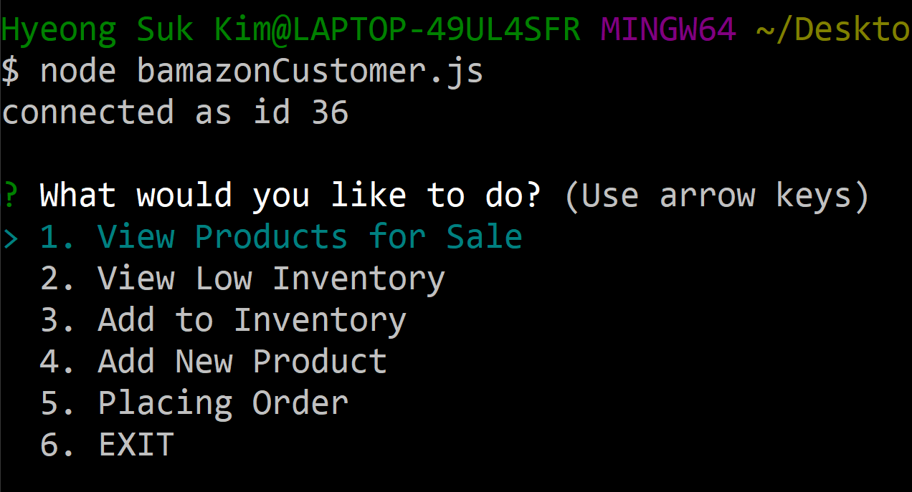

# bamazon

## Description
This is an Amazon-like storefront which will take in orders from customers and deplete stock from the store's inventory. This Command Line Interface (CLI) application supports users to manage products in stock. 

There are two individual applications for customers and supervisors.

1. `bamazonCustomer.js`
    * View Products for Sale
    * View Low Inventory
    * Add to Inventory
    * Add New Product
    * Placing Order

2. `bamazonSupervisor.js`
    * View Product Sales by Department
    * Create New Department

## Use Example:

    1. View Products for Sale
### 

    2. View Low Inventory    
### 

    3. Add to Inventory    
### 

    4. Add New Product
### 

    5. Placing Order
### 

## Getting Started

### Dependencies

* This node application uses command line interface (ex. git bash, termainal) to execute program.

### Installing

* Git Bash, Or Any types of Command Line Interface of your choice
* npm packages (`mysql`, `inquirer`)

### Executing program

1. Navigate in to the directory and use command line interface to run the following command.
    * `node bamazonCustomer.js`

2. Follow the instruction on the menu. 

## Deployed Page:
* Not Available for this application.

## Enhancements

* list of possible enhancements
    - [ ] Challenge #3: Supervisor View has not been implemented yet.
        * [ ] View Product Sales by department
        * [x] Department
    * Create New Department
        * This app should track product sales across your store's departments and should provide a summary of the highest-grossing departments in the store.
    
## Authors

* Hyeong Suk Kim - whddkf2004@gmail.com

## Technologies used in the App
* npm packages (`mysql`, `inquirer`)
    * MySQL and Inquirer npm packages are needed for data input and storage.
* MySQL
* JavaScript

<!-- ## License -->
## Version History

* 0.1  Initial Release