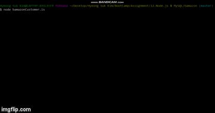
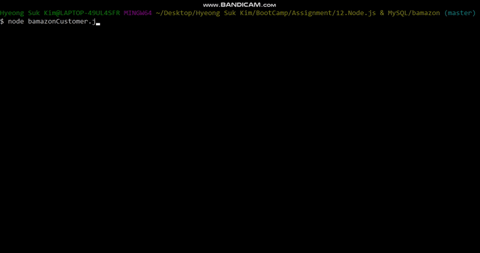
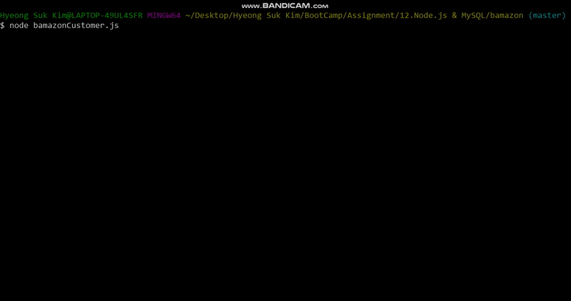

# bamazon

## Description

This is an Amazon-like storefront which will take in orders from customers and deplete stock from the store's inventory. This Command Line Interface (CLI) application supports users to manage products in stock. 

* With this CLI app, users can...
    1. View Products for Sale
    2. View Low Inventory
    3. Add to Inventory
    4. Add New Product
    5. Placing Order

## Use Example:

    1. View Products for Sale

### 
    2. View Low Inventory
    
### 
    3. Add to Inventory
    
### 
    4. Add New Product
### 
    5. Placing Order
### 

## Screen Captures:

* Home page - trending movies
  

  
  
* Detail page - trailer section
  
  
  
  
* Detail page - information section
  

- Search page - movie search

- Search page - actor/actress search	

* Bookmarks Modal:
  

## Getting Started

### Dependencies

* This node application uses command line interface (ex. git bash, termainal) to execute program.

### Installing

* Git Bash, Or Any types of Command Line Interface of your choose

### Executing program

* open in browser 
    1. scroll thru trending movie posters and click on title poster to jump to detail page
    2. click on nav link to search page
        1. enter search criteria (movie or actor/actress) and hit search button
        2. scroll thru search results and click title to jumpt to detail page
    3. When on detail page carousel of recommended movies is shown at bottom of page - click on
       title to reload detail page with that movie
    3. Use nav links to move between landing page, search page and detail page    
    4. When on detail page add or remove title from the Save List using button
    5. When on landing page call up the Save List from navbar button
    6. Remove titles from the Save List with checkboxes and delete button.
    7. Click on a movie title in Save List to load detail page with it 

## Deployed Page:
* Not Available for this program.

## Enhancements

* list of possible enhancements
    - [ ] Challenge #3: Supervisor View has not been implemented yet.
        * This app should track product sales across your store's departments and should provide a summary of the highest-grossing departments in the store.
    
## Authors

* Hyeong Suk Kim - whddkf2004@gmail.com

## Technologies used in the App
* npm packages (`mysql`, `inquirer`)
    * MySQL and Inquirer npm packages are needed for data input and storage.
* MySQL
* JavaScript

## License

## Version History

* 0.1  Initial Release